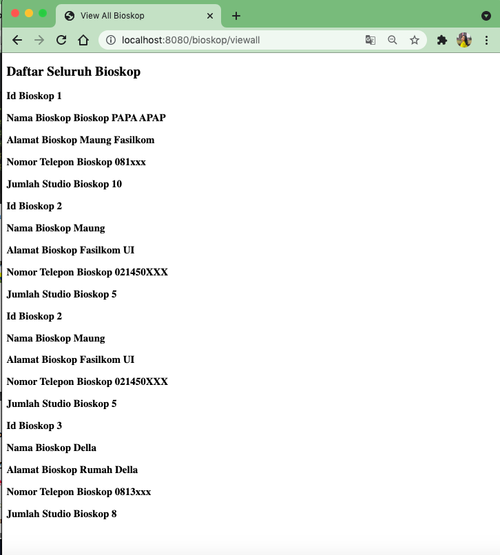

# Tutorial APAP
## Authors
* **Della Patricia Siregar** - *1906399436* - *C*

---
## Tutorial 6
1. Jelaskan secara singkat perbedaan Otentikasi dan Otorisasi! Di bagian mana (dalam kode yang telah anda buat) konsep tersebut diimplementasi?
Autentikasi adalah proses dari pengidentifikasian suatu pengguna sedangkan autorisasi adalah proses penentuan apakah seorang pengguna punya akses ke suatu halaman tertentu. 

Implementasi otentikasi yang saya lakukan ada pada class 
```
@Autowired
    public void configAuthentication(AuthenticationManagerBuilder auth) throws Exception{
        auth.userDetailsService(userDetailsService).passwordEncoder(encoder());
    }
```

Implementasi otorisasi yang saya lakukan ada pada class
```
 @Override
    protected void configure(HttpSecurity http) throws Exception {
        http
                .authorizeRequests()
                .antMatchers("/css/**").permitAll()
                .antMatchers("/js/**").permitAll()
                .antMatchers("/user/add").hasAuthority("ADMIN")
                .antMatchers("/user/viewall").hasAuthority("ADMIN")
                .anyRequest().authenticated()
                .and()
                .formLogin()
                .loginPage("/login").permitAll()
                .and()
                .logout().logoutRequestMatcher(new AntPathRequestMatcher("/logout")).logoutSuccessUrl("/login").permitAll();
    }
```

2. Apa itu BCryptPasswordEncoder? Jelaskan secara singkat cara kerja dan tujuannya.
BCryptPasswordEncode adalah kelas yang mengimplement PasswordEncode dimana kelas ini akan melakukan hashing untuk menyimpan password dalam suatu database. Secara singkat BCrypt akan menerima password berbentuk plain text dan akan melakukan hashing untuk disimpan pada database. Tujuannya adalah agar password tidak bisa diketahui oleh siapapun selain pemilik password tersebut dimana hal tersebut akan menghindari peretasan informasi pengguna.

3. Apakah penyimpanan password sebaiknya menggunakan encryption atau hashing? Mengapa demikian?
Encryption sendiri adalah proses dalam mengubah plaintext menjadi ciphertext atau suatu pesan yang sulit untuk dibaca. Walaupun sulit namaun proses pengubahn kembali dari ciphertext ke ;aintest masih mudah dilakukan. Berbeda dengan hashing dimana proses dalam mengubah suatu informasi menggunakan hash funcion dimana informasi mentah dari bahan utama tidak dapat langsung kita dapatkan dengan mudah oleh siapapun. Sehingga password akan lebih aman jika metode penyimpanannya  menggunakan hashing.

4. Jelaskan secara singkat apa itu UUID beserta penggunaannya!
UUID atau Universally Unique Identifier adalah suatu kode dengan hashing sebanyak 32 karakter yang digunakan untuk keamanan data. UUID akan digenerate untuk id pengguna, berbeda dari BCrypt yang adalah untuk password dimana, yang berguna untuk mengamankan id pengguna dari peretasan. UUID dapat dipastikan berbeda/unik untu setiap objek yang ada di internet sehingga id pengguna akan jadi lebih aman.

5. Apa kegunaan class UserDetailsServiceImpl.java? Mengapa harus ada class tersebut?
Kelas UserDetailsServiceImpl akan memberikan informasi pada SpringBoot tentang autorisasi dan autentikasi akun yang ada dimana pada kelas lain, informasi tersebut tidak dapat diberikan sehingga kelas ini harus ada. Kelas ini mampu memberi informasi tersebut dikarenakan kelas ini mengimplements UserDetailService yang merupakan interface yang disediakan oleh Spring Security. Kelas ini mengoverride satu kelas yaitu loadUserByUsername() yang dapat kita customize untuk digunakan dalam mencari user.
---
## Tutorial 5

### Pertanyaan
1. Apa itu Postman? Apa kegunaannya?
Postman adalah alat berupa plugin untuk membagikan, membuat dan menguji coba APIs. Aplikasi ini akan mempermudah untuk membuat dan menyimpan request HTTP/s dimana Postman juga akan menampilkan response dari request tersebut. Request yang bisa kita lakukan pada Postman ada banyak sekali seperti GET, POST, PUT, DELETE, COPY, dan lain-lainnya. Yang utamanya, aplikasi ini akan membantu kita dalam mengembangkan APIs dengan cara  yang lebih mudah dan efisien.

2. Jelaskan fungsi dari anotasi @JsonIgnoreProperties dan @JsonProperty.
- @JsonIgnorePropertis memiliki kegunaan pada kelas untuk menandakan suatu properti yang ingin kita abaikan dalam JSON serialization dan deserialization. Ada beberapa elemen yang dimiliki seperti allowGetters, allowSetters, ignoreUnknown and value.
- @JsonProperty adalah anotasi untuk mengindikasi nama properti dalam JSON. Anotasi ini akan melakukan serialisasi/deserialisasi nama properti saat kita menggunakan non standar getter dan setter. 

3. Apa kegunaan atribut WebClient?
WebClient atribut akan memberikan verifikasi request URI dengan objeck mock dimana atribut ini merupakan salah satu interface yang dimiliki oleh Spring. 

4. Apa itu ResponseEntity dan BindingResult? Apa kegunaannya?
- ResponseEntity adalah suatu representasi respone HTTP secara keseluruhan yaitu status code, header, dan body. ResponseEntity dapat digunakan untuk mengkonfirugasi HTTP response secara keseluruhan
- BindingResult adalah suatu objek yang menyimpan hasil binding dimana BindingResult mengextend kelas Errors. BindingResult akan menyimpan validasi yang berisi kesalahan yang mungkin terjadi.

### What I did not understand
Sama seperti tutorial sebelumnya, terlalu banyak hal yang dipelajari sendiri sehingga tidak memahami lebih dalam.

---
## Tutorial 4
### What I have learned today
Saya belajar lebih dalam pada pengguna thymeleaf dimana tujuan dari thymelead sendiri adalah untuk memfasilitasi developer dalam membuat template yang rapi dan dinamis.

### Pertanyaan
1. Jelaskan perbedaan th:include dan th:replace!
Perbedaan th:include dengan th:replace adalah th:include akan mengikutsertakan konten dari suatu fragment kedalam suatu host tag dan memasukkan fragment menjadi badan tag host tanpa mengikutsertakan tag fragmentnya. Sedangkan th:replace akan mensubstitusikan host tag dengan fragmen yang berarti akan menghapus tag host kemudian tag host akan diganti dengan fragmen tambahan serta tag nya.

2. Jelaskan apa fungsi dari th:object!
th:object memiliki fungsi untuk mendefinisikan suatu objek yang memegang comman object yang adalah suatu bentuk representasi dari sisi backend.

3. Jelaskan perbedaan dari * dan $ pada saat penggunaan th:object! Kapan harus dipakai?
* pada saat penggunaan th:object adalah gambaran bahwa object akan menampung sedangkan $ merujuk pada suatu objek yang akan ditampung. * dipakai ketika akan secara menyeluruh mengambil komponen sedangkan $ dipakai ketika akan mengambil objek yang siap diparsing ke html. 

### What I did not understand
Sama seperti tutorial sebelumnya, terlalu banyak hal yang dipelajari sendiri sehingga tidak memahami lebih dalam.

---
## Tutorial 3
### What I have learned today
Saya telah mempelajari tentang Java Persistence API (JPA) lalu juga berkenalan dengan XAMPP, Apache, MySql PHPmyadmin. Saya juga mempelajari relasi database pada spring boot dimana. 

### Pertanyaan
1. Tolong jelaskan secara singkat apa kegunaan dari anotasi-anotasi yang ada pada model (@AllArgsConstructor, @NoArgsConstructor, @Setter, @Getter, @Entity, @Table)
@AllArgsConstructor akan mengenerate sebuah constructor dengan 1 parameter sedangkan @NoArgsConstructor akan mengenerate sebuah constructor tanpa parameter. Untuk @Getter dan @Setter, keduanya akan mengenerate getter/setter secara otomatis pada setiap field yang ada pada kelas. Lalu @Entity adalah anotasi JPA yang memiliki fungsi untuk menganotasikan sebuah kelas sebagai suatu JPA entity class. Terakhir adalah @Table dimana anotasi tersebut memiliki fungsi untuk menentukan detail yang lebih jelas terkait tabel yang berhubungan dengan kelas.

2. Pada class BioskopDB, terdapat method findByNoBioskop, apakah kegunaan dari method tersebut?
Kegunaan dari method adalah untuk mencari BioskopModel pada database Bioskop berdasarkan nomor bioskop.

3. Jelaskan perbedaan kegunaan dari anotasi @JoinTable dan @JoinColumn 
@JoinTable akan menyimpan hubungan antara suatu tabel a dan tabel b dalam suatu tabel yang baru sedangkan @JoinColumn akan menyimpan hubungan kedua tabel dalam suatu kolom baru. @JoinColumn akan memberikan entitas yang berhubungan dengan entitas lain suatu foreign key sedangkan @JoinTable akan menyajikan seluruh hubungan antar entitas. 

4.  Pada class PenjagaModel, digunakan anotasi @JoinColumn pada atribut bioskop, apa kegunaan dari name, referencedColumnName, dan nullable dalam anotasi tersebut? dan apa perbedaan nullable dan penggunaan anotasi @NotNull
Kegunaan "name" adalah sebagai foreignkey pada sebuah kolom. Sedangan "referencedColumnName" akan mendefine nama untuk suatu kolom pada tabel yang kita refer. Nullable akan menentukan apakah suatu kolom bisa mengandung nilai null atau tidak. Perbedaanya dengan @NotNull adalah anotasi @NotNull akan langsung menentukan bahwa suatu metode tidak boleh return null.

5. Jelaskan kegunaan FetchType.LAZY, CascadeType.ALL, dan FetchType EAGER!
FetchType.EAGER digunakan saat kita ingin mendapatkan seluruh elemen suatu relasi dimana sintaks ini dapat memperlambat jalannya aplikasi karena ia akan mengambil data-data yang juga tidak diperlukan ketika dipanggil pada suatu kasus. Sedangkan FetchType.LAZY digunakan saat kita ingin mendapatkan elemen yang kita butuhkan saja sehingga aplikasi akan berjalan lebih cepat dibandingkan dengan FetchType.EAGER. Untuk CascadeType.ALL adalah suatu set operasi cascadable untuk entitas yang saling berhubungan dimana set operasi ini akan perform beberapa operasi seperti PERSIST, MERGE, REMOVE, DETACH, REFRESH untuk entitas parent.

### What I did not understand
Terlalu banyak materi yang diserap sehingga setiap ilmu yang saya dapatkan belum terlalu saya pahami tetapi saya bisa mengikutinya seiring pengerjaan walau memerlukan wakt yang cukup lama.

---
## Tutorial 2
### What I have learned today
Saya jadi lebih memahami PathVariable dan RequestParam. Pemahaman saya saat PPW dan juga DDP terpakai disini. Saya juga semakin memahami alur dari Springboot karena tutorial ini.

### Github
1. Pertanyaan 1: Cobalah untuk menambahkan sebuah Bioskop dengan mengakses link berikut:
   ```
   http://localhost:8080/bioskop/add?idBioskop=1&namaBioskop=Bioskop%20PAPA%20APAP&alamat=Maung%20Fasilkom&noTelepon=081xxx&jumlahStudio=10
   ```
   Apa yang terjadi? Jelaskan mengapa hal tersebut dapat terjadi.

Yang terjadi adalah Whitelabel Error Page dengan error 500. Path name /bioskop/add akan memanggil addBioskop method dimana method tersebut akan return suatu template. Namun, page html dengan nama add-bioskop belum dibuat sehingga menimbulkan error.

2. Pertanyaan 2: Menurut kamu anotasi @Autowired pada class Controller tersebut merupakan implementasi dari konsep apa? Dan jelaskan secara singkat cara kerja @Autowired tersebut dalam konteks service dan controller yang telah kamu buat. 

@Autowired ditaruh di atas properti dimana anotasi ini akan mengeliminasi kebutuhan properti untuk menciptakan getter setter. Spring akan otomatis injection dengan anotasi tersebut karena anotasi ini adalah fitur utama dari Dependency Injection. Walaupun masih sedikit dampaknya, namun implementasi anotasi ini bisa mempermudah kita dalam penulisan kode.

3. Pertanyaan 3: Cobalah untuk menambahkan sebuah Bioskop dengan mengakses link berikut:
   ```
   http://localhost:8080/bioskop/add?idBioskop=1&namaBioskop=Bioskop%20PAPA%20APAP&alamat=Maung%20Fasilkom&noTelepon=081xxx 
   ```
   Apa yang terjadi? Jelaskan mengapa hal tersebut dapat terjadi.

Yang terjadi adalah Whitelabel Error Page dengan error 400 yaitu Bad Request. Yang terjadi adalah pada URL, kurang query pada query parameters dimana jika mengakses path /bioskop/add dibutuhkan 5 query tetapi hanya 4 query yang ada pada query parameter.
   
4. Pertanyaan 4: Jika Papa APAP ingin melihat Bioskop dengan nama Bioskop Maung, link apa yang harus diakses?

Jika belum menambahkan nama Bioskop Maung, maka harus menambahkan Bioskop Maung terlebih dahulu dengan:
   ```
   http://localhost:8080/bioskop/add?idBioskop=1&namaBioskop=Maung&alamat=Fasilkom%20UI&noTelepon=021450XXX&jumlahStudio=5
   ```
   
Kemudian akses Bioskop tersebut dengan:
   ```
   http://localhost:8080/bioskop/view?idBioskop=1
   ```

6. Pertanyaan 5: Tambahkan 1 contoh Bioskop lainnya sesukamu. Lalu cobalah untuk mengakses http://localhost:8080/bioskop/viewall , apa yang akan ditampilkan? Sertakan juga bukti screenshotmu.

Saya menambahkan:
   - idBioskop : 3
   - nama Bioskop : Della
   - alamat rumah : Della
   - notelepon : 0813xxx
   - jumlah studio : 8 

Saya tambahkan dengan link ini:
   ```
   http://localhost:8080/bioskop/add?idBioskop=3&namaBioskop=Della&alamat=Rumah%20Della&noTelepon=0813xxx&jumlahStudio=8
   ```
   
   Lalu ketika view all, terlihat bioskop custom yang saya buat di paling bawah.
   

### What I did not understand
Saya memahami lab kali ini walaupun sedikit-sedikit lupa dengan materi PPW dan DDP. Tetapi dengan melihat beberapa dokumen Springboot dan tutorial sebelumnya, saya jadi lebih familiar. Namun pemakaian @Override, @Autowired dan lainnya masih kurang bisa dipahami dan tidak familiar.


---
## Tutorial 1
### What I have learned today
### Github
1. Apa itu Issue Tracker? Apa saja masalah yang dapat diselesaikan dengan Issue Tracker?

   Issue Tracker adalah fitur yang dimiliki GitHub untuk membuat ataupun mengetahui masalah apa yang terjadi selama proses pengerjaan. Dengan adanya fitur ini, akan lebih mudah untuk bisa melacak apakah ada sesuatu yang tidak bekerja, memberitahu perubahan yang dilakukan, meminta bantuan, ataupun masukan yang harus dilakukan dalam pekerjaan yang ada di repository ini. Komunikasi antar anggota dalam mengerjakan proyek juga akan semakin efisien dengan adanya fitur issue tracker ini.

2. Apa perbedaan dari git merge dan git merge --squash?

   Git merge adalah aktivitas yang dilakukan git untuk mengambil konten dari suatu branch dan menyatukannya dengan branch yang ditargetkan dimana akan terbentuk suatu commit baru yang memiliki dua parent yaitu kedua branch yang digabungkan. Sedangkan git merge --squash adalah suatu opsi merge yang akan menggabungkan kedua branch namun commit baru akan hanya memiliki satu parent yaitu parent dari master.

3. Apa keunggulan menggunakan Version Control System seperti Git dalam pengembangan
   suatu aplikasi?
- Dengan menggunakan version control system, **_dokumentasi_** dari pekerjaan bisa
  dijabarkan dengan mendetail.
- Akan lebih mudah untuk bisa **_melacak_** dokumen apa saja yang mengalami perubahan, dokumen yang dihapus, dan seluruh aktivitas jika menggunakan Version Control System seperi Git.
- Juga untuk pekerjaan yang dilakukan bersamaan, seluruh anggota bisa dengan **_bebas_** melakukan tugasnya masing-masing dan diakhir pekerjaan, seluruh anggota dapat menyatukan kembali pekerjaan yang telah dilakukan masing-masing anggotanya dengan mudah.


### Spring
4. Apa itu library & dependency?

   **Library** adalah kumpulan-kumpulan kode yang bisa digunakan oleh kita dalam membangun suatu projek. Sedangkan **Dependency** adalah hubungan antara proyek kita dengan beberapa library yang kita pilih untuk berkolaborasi dalam membangun proyek kita. Kita tidak bisa mengatakan bahwa semua library saling bergantung atau _dependen_ tetapi ketika kita memilih beberapa library untuk membangun proyek kita, maka kumpulan library tersebut disebut _dependency_.

5. Apa itu Maven? Mengapa kita menggunakan Maven? Apakah ada alternatif dari Maven?

   Maven adalah sebuah tools untuk membangun projek, membuat laporan, sampai dokumentasi yang berbasis kosnep project object model (POM). Kita menggunakan Maven karena Maven memiliki _dependency management_ jadi kita bisa hanya mendefinisikan dependency yang kita perlukan dalam sebuah file POM dan Maven akan otomatis mengunduhnya. Juga yang paling terpenting adalah karena kita akan bekerja dalam tim untuk membangun suatu aplikasi, besar kemungkinan bahwa anggota-anggota tim akan memakan IDE favorit mereka dan setiap IDE tentunya memiliki struktur yang berbeda. Namun dengan Maven, akan ada hanya satu struktur yang bisa diadaptasikan oleh setiap IDEnya sehingga anggota tim bisa bekerja dengan IDE yang disukai. Beberapa alternatif lain Maven adalah Gradle, GNU Make, CMake, Meson dan SCons.

6. Selain untuk pengembangan web, apa saja yang bisa dikembangkan dengan Spring
   framework?

   Selain untuk pengembangan web, Spring dapat membantu dalam:
- Pemrosesan beberapa data tanpa adanya interupsi eksternal
- Pengaksesan data dan integrasi
- Pembangunan aplikasi Enterprise

7. Apa perbedaan dari @RequestParam dan @PathVariable? Kapan sebaiknya
   menggunakan @RequestParam atau @PathVariable?

   @RequestParam digunakan untuk get parameter yang di request dari sebuah URL atau dikenal dengan query parameter sedangkan @PathVariable mengekstraksi value dari URI.

   @RequestParam digunakan saat sebuah URL memiliki key value setelah tanda '?' yang biasa dikenal dengan query paramaeter dan kita ingin mengambil data key value tersebut.
   Contoh:
   http://localhost:8080/npm?id=della berarti bisa mendapatkan nilai nama yaitu della dengan
    ```
    @GetMapping("/foos")
    @ResponseBody
    public String getNpmByIdUsingQueryParam(@RequestParam String id) {
      return "ID: " + id;
    }
    ```
    Untuk @PathVariable digunakan saat ingin mengambil data langsung dari URI templatenya.
    Contoh:
    http://localhost:8080/npm/della bisa mendapatkan nilai nama yaitu della dengan 
    ```
    @GetMapping("/npm/{id}")
    @ResponseBody
    public String getNpmById(@PathVariable String id) {
      return "NPM: " + id;
    }
    ```

### What I did not understand
Saya sebenarnya masih kurang memahami sepenuhnya dengan proses yang terjadi dalam tutorial ini dan mungkin masih kurang menangkap apa tujuan yang mau kita capai pada pengerjaan tutorial ini. Lalu, terlalu banyak informasi baru yang saya dapatkan dalam satu kali tutorial ini sehingga masih banyak hal yang baru saya pahami hanya kulitnya saja. Seperti contohnya, saya mengerti analogi dari git merge dan git merge --squash tetapi saya kurang paham realitanya seperti apa. 
